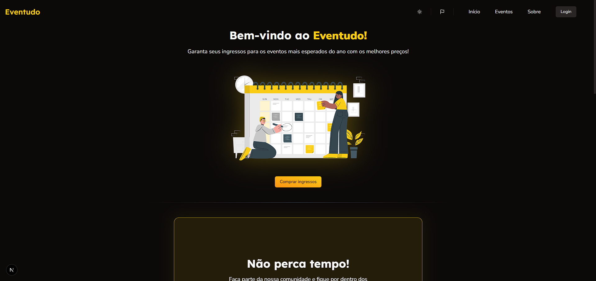

<h1 align="center">Eventudo (client)</h1>

###

<h3 align="center">Description</h3>

###

<p align="">Site para reservar seu acesso aos mais variados eventos. Feito como objeto de estudo, acesse o repositório da API para conhecer o projeto por completo: <a href="https://github.com/jpmoncao/eventudo-api" target="_blank">https://github.com/jpmoncao/eventudo-api</a></p>

###

<h3 align="center">Resources</h3>

###

<p align="">Cadastro e login de usuário, listagem de dos eventos com seus preços, informações e seus demais detalhes, pagamento de inscrição, detalhes do usuário logado, traduções em português e inglês, tema claro e noturno, entre outras funcionalidades.</p>

###

<h3 align="center">Techs</h3>

###

<div align="center">
  
  
  
  
  
</div>

### 

<h3 align="center">Getting Started</h3>

###

Para rodar na sua máquina:

```bash
cd eventudo-front

npm install

npm run dev
```

Abra [http://localhost:3000](http://localhost:3000) no seu navegador.

#



<h1 align="left"></h1>

###

<div align="center">
    <span width="72">
        <a href="https://linkedin/in/jpmoncao" target="_blank">
            
        </a>
    </span>
    
    <span width="72">
        <a href="https://instagram.com/jpmoncao" target="_blank">
            
        </a>
    </span>
    
    <span width="72">
        <a href="https://github.com/jpmoncao" target="_blank">
            
        </a>
    </span>
</div>

###
